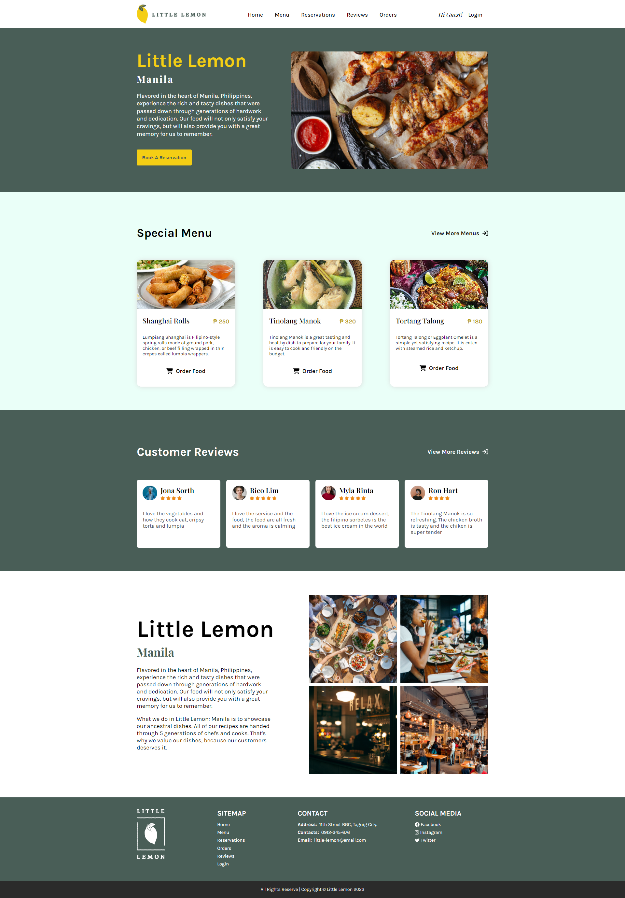
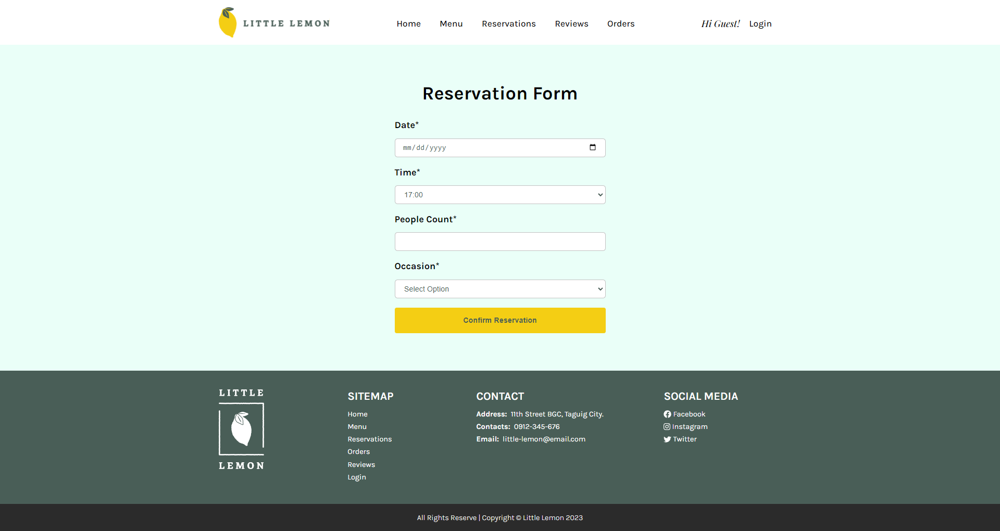

# Little Lemon: Meta Frontend Capstone

This is the assignment of Greniel Galinato for the Meta Frontend Castone

## Preview Site

## How to start and test

### `npm start`

Runs the app in the development mode.\
Open [http://localhost:3000](http://localhost:3000) to view it in your browser.

The page will reload when you make changes.\
You may also see any lint errors in the console.

### `npm test`

`
Launches the test runner in the interactive watch mode.\
See the section about [running tests](https://facebook.github.io/create-react-app/docs/running-tests) for more information.
